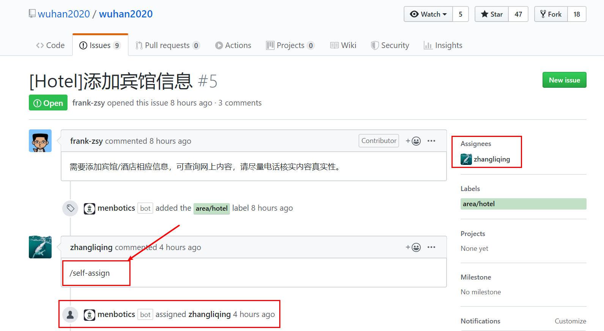
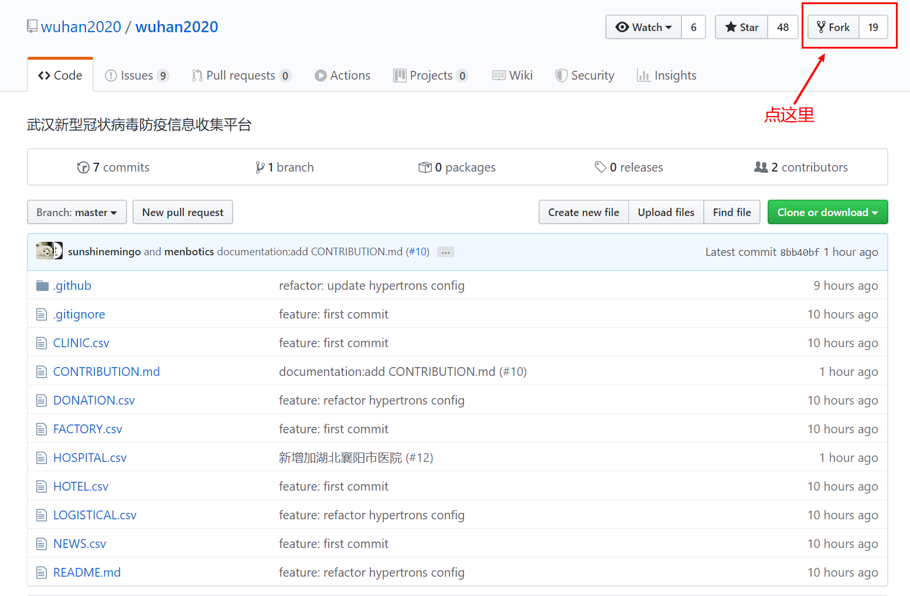
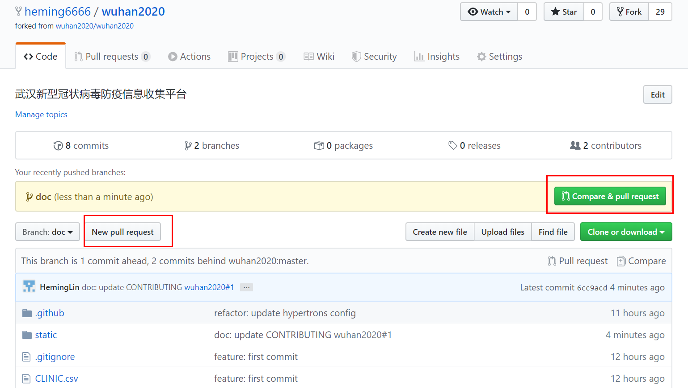
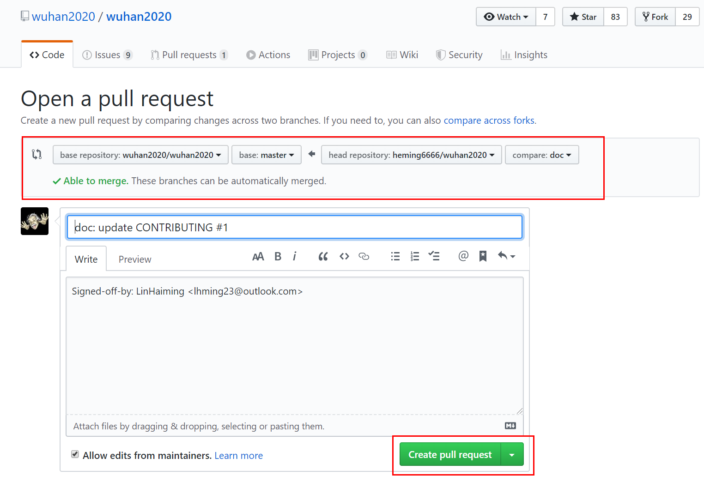

# 贡献指南

<!-- TOC -->
*WE PROVIDE ENGLISH VERSION, PLEASE CLICK [HERE](https://github.com/wuhan2020/wuhan2020/blob/master/CONTRIBUTING_EN.md)*

- [贡献指南](#贡献指南)
  - [我要提交数据信息](#我要提交数据信息)
  - [我要提 ISSUE，提 PR](#我要提-issue提-pr)
    - [0、提交 issue](#0提交-issue)
    - [1、认领任务](#1认领任务)
    - [2、Fork 本仓库](#2fork-本仓库)
    - [3、Clone 仓库](#3clone-仓库)
    - [4、新建 `branch`](#4新建-branch)
    - [5、修改内容，并提交](#5修改内容并提交)
    - [6、同步上游仓库变更](#6同步上游仓库变更)
    - [7、推送新分支到自己的远程仓库](#7推送新分支到自己的远程仓库)
    - [8、提 `Pull Request`](#8提-pull-request)
    - [9、如果你的代码合并时出现冲突时，你可以：](#9如果你的代码合并时出现冲突时你可以)
    - [10、当你的代码被合并进去以后，你可以：](#10当你的代码被合并进去以后你可以)
  - [项目机器人说明](#项目机器人说明)
  - [Slack 交流群组](#slack-交流群组)

<!-- /TOC -->

## 我要提交数据信息

**该仓库为数据主仓，所有数据由脚本自动提交导入，请不要在该仓库中直接提交数据信息，提交数据信息，请参考 [README](./README.md)**。

> 本平台使用石墨文档收集数据信息，并由脚本定时以 PR 形式提交数据到该仓库，请不要在该仓库中直接修改数据文件。

> 由于参与人员较多，不开放所有人员的编辑权限，请在[这里](https://shimo.im/forms/YVJkGrGCWwQPTpqY/fill)填写申请，会定向邀请到特定表单中进行信息录入。


## 我要提 ISSUE，提 PR
这篇指南会尽可能清楚地描述 GitHub 操作流程，欢迎提交 issue， 或者直接修改提交 PR，为 **wuhan2020** 贡献一份自己的力量！

### 0、提交 issue

有任何想法或问题，欢迎到 [这里](https://github.com/wuhan2020/wuhan2020/issues) 提交 `issue`，参与项目的志愿者将会及时沟通交流。

在提交 `issue` 时，请确定 `issue` 的类型，并在标题中注明，项目的机器人将会自动打上对应的标签：

-   hospital: 医院相关信息
-   factory: 生产相关信息
-   logistical: 物流相关信息
-   hotel: 酒店相关信息
-   donation：捐款相关信息
-   clinic：义诊相关信息
-   news：疫情新闻动态相关信息
-   doc: 文档相关
-   bug： 缺陷反馈
-   feature: 新的特性

### 1、认领任务

> **衷心地希望大家能为本项目添砖加瓦，齐心协力，共克时艰！**

在 [Issue 列表](https://github.com/wuhan2020/wuhan2020/issues) 中挑选任务。然后在该 `issue` 中使用 `/self-assign`命令领取任务。项目的机器人将会自动将该`issue`的`Assignees`指定为自己。

```
/self-assign
```

示意图如下：



### 2、Fork 本仓库

访问 [wuhan2020 仓库的主页](https://github.com/wuhan2020/wuhan2020)，并 Fork 到自己的账号下。



> 注：以下内容是在命令行终端里面操作，需要安装 [Git](https://git-scm.com/).

### 3、Clone 仓库

回到自己的 GitHub 主页，并找到刚刚 Fork 过来的 _wuhan2020_ 仓库，进入仓库主页, 将该仓库 `clone` 到本地，如：

```bash
# 将下面的 XXX 替换成你自己的用户名
git clone git@github.com:XXX/wuhan2020.git
cd wuhan2020
```

### 4、新建 `branch`

> 非紧急修复，不建议在 master 分支进行开发修改。

根据该分支的用途，起一个恰当的分支名称，新建分支，如：

```bash
git checkout -b my-fix-branch master
```

### 5、修改内容，并提交

对相应文件做出修改，修改完成后，提交：

```bash
git add .
git commit -m "hotel: update HOTEL.csv, fix #1"
```

提交时，尽量：

(1) 用一句话清楚的描述这次提交做了什么。

(2) 关联相关 `issue`，如 `fix #1` 、`close #2`、`#3`

如果 `commit` 之后，又做了修改，可以使用 `--amend` 参数：

```bash
git add .
git commit --amend -sm "hotel: update HOTEL.csv, fix #1"
```

### 6、同步上游仓库变更

同步上游仓库变更(即 [wuhan2020/wuhan2020](https://github.com/wuhan2020/wuhan2020) )，因为可能有其他人先于你提交到上游仓库，防止冲突：

```bash
$ git remote add upstream git@github.com:wuhan2020/wuhan2020.git
$ git fetch upstream
```

若上游仓库有变更，需要先进行 `rebase`:

```bash
$ git rebase upstream/master
```

### 7、推送新分支到自己的远程仓库

```bash
$ git push -f origin my-fix-branch:my-fix-branch
```

### 8、提 `Pull Request`

在自己仓库的页面上提`pull request` 到上游仓库。如下图所示。




如果其他人 `review` 之后，需要再进行更改，就修改相关内容，然后执行以下操作，该 PR 将会自动同步该 `commit` 。

```bash
git add .
git commit --amend
git push -f origin my-fix-branch
```

### 9、如果你的代码合并时出现冲突时，你可以：

> 注：如果未出现冲突，则无需进行以下操作

-   先同步上游仓库变更

```bash
git fetch upstream
```

-   进行`rebase`:

```bash
git rebase upstream/master
```

-   手动解决冲突内容，之后重新提交：

```bash
git add my-fix-file
git rebase --continue
git push -f origin my-fix-branch
```

### 10、当你的代码被合并进去以后，你可以：

-   切回到 `master` 分支：

```bash
git checkout master -f
```

-   保持本地 `master` 分支与上游分支同步：

```bash
git pull --ff upstream master
```

-   删除本地分支(可选):

```bash
git branch -D my-fix-branch
```

-   删除远程分支(可选)：

```bash
git push origin --delete my-fix-branch
```

## 项目机器人说明

本项目已接入 Github 机器人：`Menbotics`，该机器人可以：

-   **`Issue` 自动打标签**：具体见 [0、提交 issue](#0提交-issue)
-   **任务认领**：具体见 [1、认领任务](#1认领任务)
-   **代码自动合并**：有 PR(Pull Request) 提交上来之后，有代码合并权限的人员使用 `/approve` 让机器人自动合入代码。

机器人配置见 [hypertrons.json](./.github/hypertrons.json)，如在该配置文件中可以看到具体有哪些人员有代码合并权限。

## Slack 交流群组

此外，我们已经建立了 [Slack 交流群组](https://join.slack.com/t/wuhan2020/shared_invite/enQtOTQxMTU4MzgyNTYwLWIxMTMyNWI4NWE2YTk3NGRjZGJhMjUzNmJhMjg1MDQ3OTEzNDE5NGY4MWFhMjRlYWU4MmE3ZGQyOGU4N2YwMzY)，已建立前端、后端、数据同步等对应 channel，欢迎大家加入共同探讨各类技术或非技术类问题，让我们大家一起齐心协力，众志成城，共克时艰！
