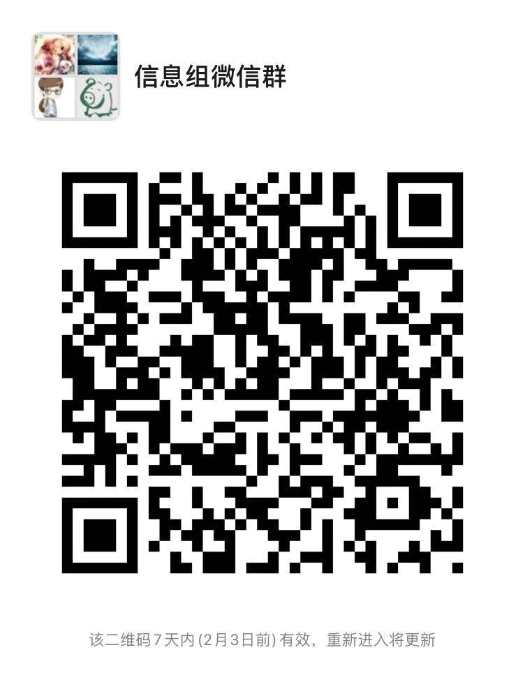

# Data Collection Guide

We have founded an information team. The information collected by our platform includes following types.

Due to the large number of participants, the editing authority has limitation. Please fill the application form [here](https://shimo.im/forms/YVJkGrGCWwQPTpqY/fill). We will invite you to join us.

For those who want to join the information team, please 
1. Scan the following WeChat QR Code:

2. Register a Shimo.im account. When you are filling the application form, please make sure your email address is the same one as your registered Shimo.im account. You will be invited via this email address afterwards to collaborate with us for the information collection work. In your application, please select your working preference from following categories: hospital, hotel, logistics, free medical consultation, donation, and manufacturer. You can choose one or multiple categories. You will be re-assigned to another category if there are too many people in one category and there are demands in the other categories.

3. Please be responsible to the epidemic area when you are entering any information and **_make sure the information is valid_**. For those information related to hospitals, hotels, logistics and donations, **_please attach official web link. For supplier information declaration, please append qualification certification, such as business certificate, industrial and commercial information, etc._** to make sure the validity of suppliers and already get the permission from the suppliers.

4. Before entering any information, please verify the information source by yourself first. Do NOT enter information without official links and do NOT enter unconfirmed information. 

Our platform is using Shimo.im to collect information, and use script to push to this repo by using PR. **Do NOT edit files directly in this repo.**

### Hospital:

Please refer to [this shimo document](https://shimo.im/sheets/k399pHyt6HKvW6xR/MODOC/)

### Hotel:

Please refer to [this shimo document](https://shimo.im/sheets/Hd9C3QytrJK3RWxG/z1rye/)

### Logistics:

Please refer to [this shimo document](https://shimo.im/sheets/RTHXp3ghtKXY3GcC/MODOC/)

### Manufacturer:

Please refer to [this shimo document](https://shimo.im/sheets/pchvJ6ddyRHHdXtv/MODOC/)

### Donation:

Please refer to [this shimo document](https://shimo.im/sheets/W3gxW6cwkYTDY6DD/)

### Free medical consultation:

Please refer to [this shimo document](https://shimo.im/sheets/JgXjYCJJTRQxJ3GP/MODOC/)

 *Trasnlator: Leon, Rae.
